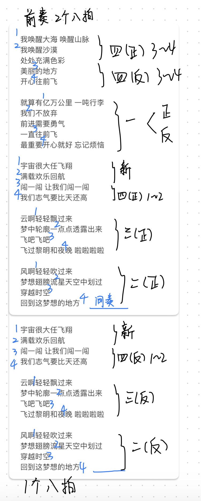

# our aerobics resources

这是2024年春夏学期寿旻超老师的健美操周二下午12节班级第三组的健美操相关资源整合，用于帮助组员们跟踪队形、动作、音乐等元素的调整。

## log

因为每次排练的调整内容可能不是commit记录上能简要概括的，所以也会在这个文档中更新（包含日期以及排练的序号）

### 2024/5/6 初版

#### 队形变换

<video width="800" height="600" controls>
  <source src="video/formation.mp4" type="video/mp4">
  Your browser does not support the video tag.
</video>

#### 整体结构

##### 开头结尾的编排

##### 中间走位动作

<video width="800" height="600" controls>
  <source src="video/moving.mp4" type="video/mp4">
  Your browser does not support the video tag.
</video>

##### 中间新增加的动作

<video width="800" height="600" controls>
  <source src="video/new_move_mid.mp4" type="video/mp4">
  Your browser does not support the video tag.
</video>

### 2024/5/14 （课前）
增加了上述队形和动作的整合视频，并且更新了整体的结构（标出了可以跑动变换队形的动作）

#### 整体结构

#### 整合视频
<video width="800" height="600" controls>
  <source src="video/integration.mp4" type="video/mp4">
  Your browser does not support the video tag.
</video>

### 2024/5/14 （课上）

这里我们前两个八拍采取隔排轮流站蹲的形式，并且动作是镜像的，而且后两个八拍需要改成镜像做动作（为了变队形调整位置方便），然后要注意的是我们这里第四个八拍端盘子转圈的动作变成了端盘子走位到下一个队形。
 

